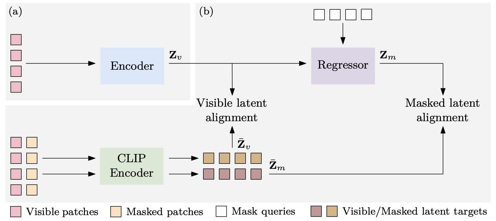

# CAE v2: Context Autoencoder with CLIP Latent Alignment 

<p align="center">
  
</p>

This is the *official* repository with PyTorch implementation of [CAE v2: Context Autoencoder with CLIP Latent Alignment](https://openreview.net/forum?id=f36LaK7M0F).

## Highlights
- Release a serious of pre-trained models in CAE v2, including CAEv2-Tiny, CAEv2-Small, CAEv2-Base and CAEv2-Large. Please refer to [Google Drive](https://drive.google.com/drive/folders/1KYi3BvOu4ZeHezurp4SWhO2_X0SR3Sa6?usp=drive_link) to download.

## Data Preparation
Download the pretrained clip model.

```bash
CLIP_MODEL_PATH=./clip_model
mkdir -p $CLIP_MODEL_PATH
wget -o $CLIP_MODEL_PATH/ViT-B-16.pt https://openaipublic.azureedge.net/clip/models/5806e77cd80f8b59890b7e101eabd078d9fb84e6937f9e85e4ecb61988df416f/ViT-B-16.pt
```

## Training
Here is the example that pretrains CAE v2 with ViT-Base model on ImageNet-1K with 8 GPUs. Please see [project/CAEv2/scripts/caev2_base_300e.sh](project/CAEv2/scripts/caev2_base_300e.sh) for complete script. Other scripts (Tiny and Small models) are also available in [project/CAEv2/scripts/](project/CAEv2/scripts/).

```bash
OMP_NUM_THREADS=1 $PYTHON -m torch.distributed.launch \
  --nproc_per_node=8 \
  --nnodes=$NNODES \
  --node_rank=$RANK \
  --master_addr=$ADDR \
  --master_port=$PORT \
  tools/run_pretraining.py \
  --model_type caev2 \
  --data_path ${DATA_PATH} \
  --output_dir ${OUTPUT_DIR} \
  --model cae_base_patch16_224_8k_vocab \
  --discrete_vae_weight_path ${TOKENIZER_PATH} \
  --discrete_vae_type $TOKENIZER_TYPE \
  --second_input_size $SECOND_INPUT_SIZE \
  --second_interpolation bicubic \
  --num_out_dim $NUM_OUT_DIM \
  --crop_min_size $CROP_MIN_SIZE \
  --crop_max_size $CROP_MAX_SIZE \
  --batch_size 256 \
  --lr 1.5e-3 --warmup_epochs 10 --epochs 300 \
  --clip_grad 3.0 --layer_scale_init_value 0.1 \
  --imagenet_default_mean_and_std \
  --color_jitter 0.4 \
  --drop_path 0.1 \
  --mask_generator block \
  --num_mask_patches $NUM_MASK_PATCHES \
  --decoder_layer_scale_init_value 0.1 \
  --no_auto_resume \
  --save_ckpt_freq 100 \
  --exp_name $my_name \
  --regressor_depth 4 \
  --decoder_depth 0 \
  --align_loss_weight 0 \
  --latent_alignment_loss_weight 1
```

- `--num_mask_patches`: number of the input patches need be masked. We use 30/49/98 for Tiny/Small/Base models respectively.
- `--batch_size`: batch size per GPU.
- Effective batch size = `number of GPUs` * `--batch_size`. So in the above example, the effective batch size is `256*8 = 2048`.
- `--lr`: learning rate.
- `--warmup_epochs`: learning rate warmup epochs.
- `--epochs`: total pretraining epochs.
- `--clip_grad`: clip gradient norm.
- `--drop_path`: stochastic depth rate.
- `--imagenet_default_mean_and_std`: enable this for ImageNet-1k pretraining, i.e., `(0.485, 0.456, 0.406)` for mean and `(0.229, 0.224, 0.225)` for std. For other pretraining data, use `(0.5, 0.5, 0.5)` for mean and `(0.5, 0.5, 0.5)` for std by default.
- `--layer_scale_init_value`: 0.1 for base, 1e-5 for large, set 0 to disable layerscale. We set `--decoder_layer_scale_init_value` the same as this.
- `--regressor_depth`: length of the regressor.
- `--decoder_depth`: length of the decoder. In CAE v2, there is not decoder.
- `--align_loss_weight`: weight for alignment loss as in CAE v1. 0 by default in CAE v2.
- `--latent_alignment_loss_weight`: weight for visible and masked latent alignment loss in CAE v2. 1 by default.

### Linear Probing
- Please refer to [project/CAEv2/scripts/caev2_base_300e.sh](project/CAEv2/scripts/caev2_base_300e.sh) in linear probing part (8 GPUs).  

### Fine-tuning
- Please refer to [project/CAEv2/scripts/caev2_base_300e.sh](project/CAEv2/scripts/caev2_base_300e.sh) in finetune part (8 GPUs). 

## Acknowledgement
This repository is built using the [BEiT](https://github.com/microsoft/unilm/edit/master/beit) and [CAE](https://github.com/Atten4Vis/CAE), thanks for their open-source code!

## Citation
```bibtex
@article{zhang2023cae,
  title={{CAE} v2: Context Autoencoder with {CLIP} Latent Alignment},
  author={Xinyu Zhang and Jiahui Chen and Junkun Yuan and Qiang Chen and Jian Wang and Xiaodi Wang and Shumin Han and Xiaokang Chen and Jimin Pi and Kun Yao and Junyu Han and Errui Ding and Jingdong Wang},
  journal={Transactions on Machine Learning Research},
  issn={2835-8856},
  year={2023}
}
```
